# Scalable-Data-Lakehouse

Głównym założeniem tego projektu jest zaprojektowanie i wdrożenie kompletnego przepływu danych (End-to-End Data Pipeline) w architekturze **Data Lakehouse**. Projekt symuluje rzeczywiste środowisko analityczne dla firmy e-commerce, przeprowadzając surowe dane przez proces ekstrakcji, transformacji i ładowania, aż po interaktywny dashboard BI.

## 📊 Wykorzystany Zbiór Danych

Projekt wykorzystuje relacyjną bazę **Olist Brazilian E-Commerce Dataset**, zawierającą ok. 100 000 zamówień z lat 2016-2018. Główne domeny danych to:

* Zamówienia i logistyka (statusy, czas dostawy).
* Dane geolokalizacyjne (klienci i sprzedawcy).
* Oceny satysfakcji (reviews).
* Katalog produktów i płatności.

## 🛠️ Architektura i Stack Technologiczny

Przepływ danych został ułożony w **Architekturze Medalionowej** (warstwy: Bronze, Silver, Gold).

* **Storage & Compute:** `DuckDB` – wbudowana (in-process) analityczna baza danych.
* **Transformacje:** `dbt` – tworzenie modeli SQL, data lineage i testy jakości danych.
* **Przetwarzanie:** `Polars` – obsługa danych pobieranych z bazy.
* **Aplikacja BI:** `Streamlit` + `Plotly` – dashboard analityczny i wizualizacja wskaźników biznesowych.

## 🗺️ Diagram Architektury

```mermaid
graph LR
    %% Konfiguracja stylów
    classDef source fill:#f9f2f4,stroke:#333,stroke-width:2px,color:#000;
    classDef process fill:#e1f5fe,stroke:#0288d1,stroke-width:2px,color:#000;
    classDef storage fill:#fff3e0,stroke:#f57c00,stroke-width:2px,color:#000;
    classDef bi fill:#e8f5e9,stroke:#388e3c,stroke-width:2px,color:#000;

    %% 1. Zrodla
    subgraph sources ["Data Sources"]
        CSV["📂 Surowe pliki CSV (Olist)"]:::source
    end

    %% 2. Ingestion
    subgraph ingestion ["Ingestion"]
        PY("⚙️ python ingest.py"):::process
    end

    %% 3. Lakehouse
    subgraph lakehouse ["DuckDB Data Lakehouse"]
        direction LR
        BRONZE[("🥉 Bronze (Surowe)")]:::storage
        SILVER[("🥈 Silver (Oczyszczone)")]:::storage
        GOLD[("🥇 Gold (Data Marts)")]:::storage
        
        BRONZE -->|dbt transform| SILVER
        SILVER -->|dbt transform| GOLD
    end

    %% 4. Serving & BI
    subgraph serving ["Serving & Analytics"]
        POLARS("⚡ Polars (In-Memory)"):::process
        ST["📊 Streamlit Dashboard"]:::bi
    end

    %% Polaczenia miedzy strefami
    CSV --> PY
    PY -->|Load| BRONZE
    
    GOLD -->|Query| POLARS
    POLARS --> ST
```



## ⚙️ Jak uruchomić projekt lokalnie

Projekt korzysta z **[uv](https://github.com/astral-sh/uv)** – nowoczesnego i błyskawicznego menedżera pakietów napisanego w Rust, który zastępuje tradycyjnego `pip`.

**Wymagania:** Zainstalowany Python 3.9+ oraz narzędzie `uv`.

1. Sklonuj repozytorium i wejdź do folderu projektu:

   ```bash
   git clone [https://github.com/TWOJ_NICK/Scalable-Data-Lakehouse.git](https://github.com/TWOJ_NICK/Scalable-Data-Lakehouse.git)
   cd Scalable-Data-Lakehouse
   ```

2. Zainstaluj wszystkie zależności i zsynchronizuj środowisko:

    ```bash
    uv sync
    ```

3. Aktywuj środowisko wirtualne:
    - Windows: .venv\Scripts\activate
    - macOS/Linux: source .venv/bin/activate

4. Wykonaj Ingestion (załaduj surowe dane do bazy):

    ```bash
    python scripts/ingest.py
    ```

5. Zbuduj architekturę Medalionową za pomocą dbt:

    ```bash
    cd transform
    dbt build
    cd ..
    ```

6. Uruchom interaktywny dashboard analityczny:

    ```bash
    streamlit run dashboard/app.py
    ```

## 📄 Licencja i Źródło Danych (Acknowledgments)

* **Zbiór Danych:** Projekt wykorzystuje publicznie dostępny zbiór [Brazilian E-Commerce Public Dataset by Olist](https://www.kaggle.com/datasets/olistbr/brazilian-ecommerce) udostępniony na platformie Kaggle. Dane te są wykorzystywane tutaj wyłącznie w celach edukacyjnych, demonstracyjnych i jako portfolio (non-commercial). Wszelkie prawa do danych należą do firmy Olist.
* **Kod Projektu:** Kod źródłowy tego repozytorium (Data Pipeline, modele dbt, aplikacja Streamlit) jest udostępniony na otwartej licencji **MIT**. Możesz go swobodnie kopiować, modyfikować
